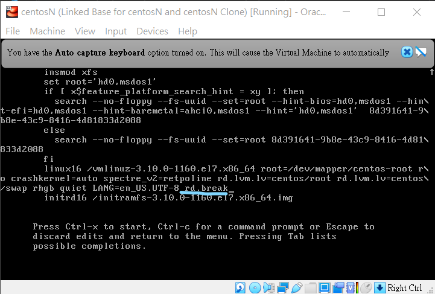
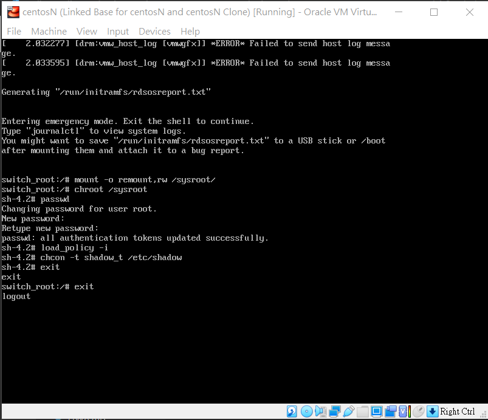

# 第4週 重設root的帳號
參考網站:[How To Reset Root Password On CentOS 7](https://www.unixmen.com/reset-root-password-centos-7/)

[Centos如何重設密碼](https://autumncher.pixnet.net/blog/post/462809249-%E3%80%90centos7%E3%80%91%E5%A6%82%E4%BD%95%E9%87%8D%E7%BD%AEroot%E5%AF%86%E7%A2%BC-(how-to-recover-root-pas))

## 實作操作

* 步驟一

開機後，按 ` e `

* 步驟二

找到結尾是 UTF-8，並在後面打上 ` rd.break ` ，接著按下 ` Ctrl + X `啟動，會進入 switch root stage

* 步驟三

跟著指令一行一行打

` mount -o remount,re /sysroot/ `

` chroot /sysroot `

` passwd `

` 輸入新密碼 `

` 再次確認新密碼 `

` load_policy -i `

` chcon -t shadow_t/etc/shadow `

` exit ` 這個需要輸入兩次

# 結論

    這樣就可以修改密碼了，但是要記得新修改的密碼喔~

