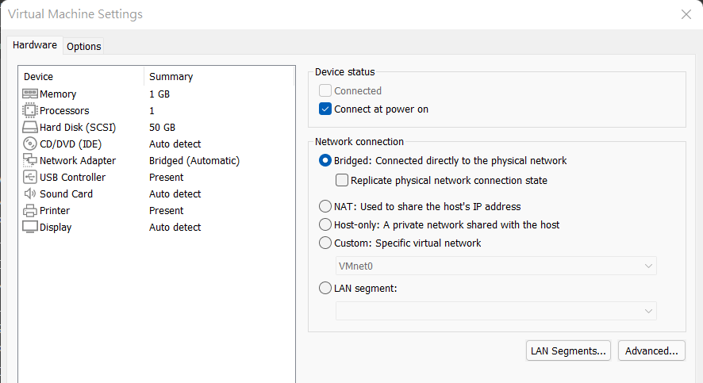
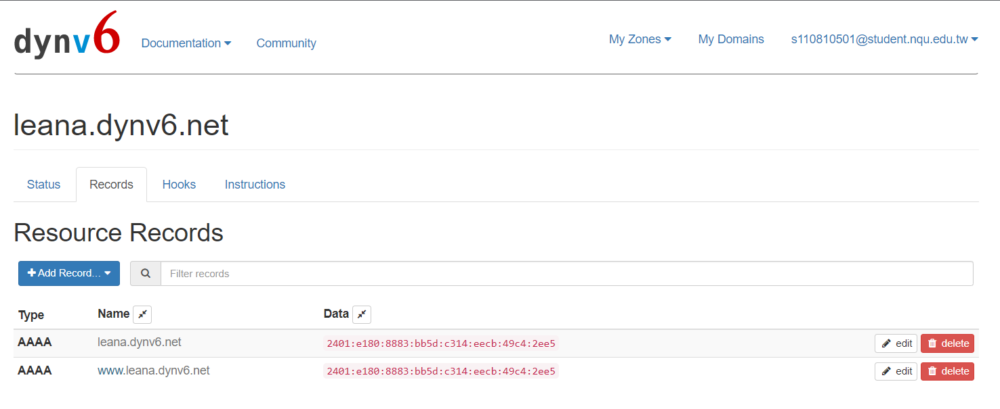
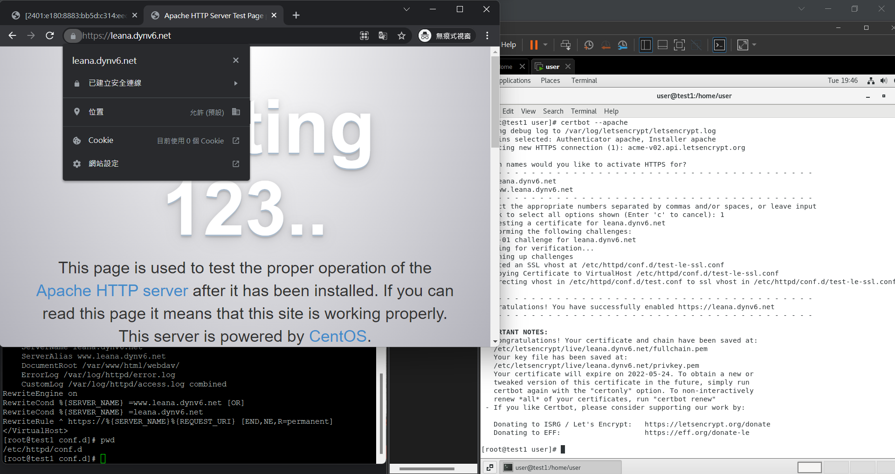

# 第二週

## 連接ipv6  
因為網址過長  
需要用查的才能找到位址  
所以可以用puttyt查到  

先在network設定改成bridge  
如果沒有看到  
要再設定加上兩行  

## 確定ipv6成功連線  
http://[2401:e180:8883:bb5d:c314:eecb:49c4:2ee5]/hi.txt  

* 記得ipv6的網址要加上`[中括號]`

憑證有效期 3個月  
在新增www的網站名稱  

-先在手機測試是否可以用  
https://test-ipv6.com/index.html.zh_TW

-先在原本設定的地方加上新的record  
https://dynv6.com/zones/3393931/records  

接著就可以執行接下來的設定囉~  

-在linux的指令 

    yum install certbot
    yum install python-certbot-apache
    ifconfig

-putty的指令  

    cd /etc/httpd/conf.d
    ls
    vim test.conf

在test.conf裡面的文字  

    <VirtualHost *:80>  
        ServerAdmin webmaster@localhost  
        ServerName leana.dynv6.net  
        ServerAlias www.leana.dynv6.net  
        DocumentRoot /var/www/html/webdav/  
        ErrorLog /var/log/httpd/error.log  
        CustomLog /var/log/httpd/access.log combined  
    </VirtualHost>  

-putty的指令

    systemctl restart httpd
    systemctl status httpd
    ls
    cat test.conf
    pwd
    history

-在linux的指令  

    certbot --apache 

在到網頁上去測試是否可以  
https://leana.dynv6.net/  
如果可以顯示表示成功 
從上面就可以看到https的安全認證是被許可的  
