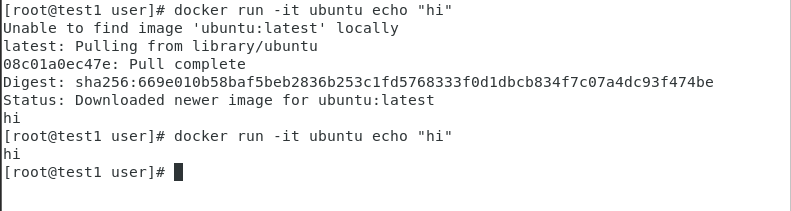
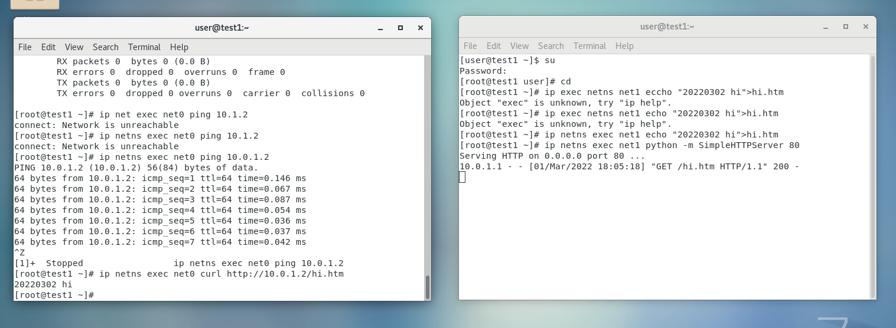

# 第三週

## 前言  
Docker輕量級虛擬化技術  
利用隔離技術  

## 隔離技術  
參考網址:https://segmentfault.com/a/1190000018391069  
網路空間的隔離  
隔出來的空間就是一台機器+網卡    
不同空間相同名字沒有關係  

檔案是共享的  
他其實是一種隔離  

---

## 實作-網路隔離

[terminal 1] 

    cd   
    ip netns add net1  
    ip netns add net0  
    ip netns ls    
    ifconfig -a  
    ip netns exec net1 ifconfig -a  
    ip netns exec net1 ifconfig lo up  
    # 開啟net1
    ip netns exec net1 ifconfig -a  
    # 可以看到net1被打開了   
    ip link add type veth  
    ip link set dev veth0 netns net0  
    ip link set dev veth1 netns net1  
    ip netns exec ifconfig  
    ip netns exec net0 ifconfig -a  
    ip netns exec net1 ifconfig -a  
    ip netns exec net0 ip link set dev veth0 name eth0  
    ip netns exec nth0 ip addr add 10.0.1.1/24 brd + dev eth0 
    ip netns exec net0 ifconfig eth0 up
    ip netns exec net1 ip link set dev veth1 name eth1 
    ip netns exec net1 ip addr add 10.0.1.2/24 brd + dev eth1  
    ip netns exec net1 ifconfig eth1 up    
    ip netns exec net0 ifconfig  
    ip netns exec net1 ifconfig  
    ip netns exec net0 ping 10.0.1.2  
    # 到這裡就可以確認可以ping

另外還可以開啟另一個Terminal去確認  
是否可以互通    

[terminal 2]

    cd 
    ip netns exec net1 echo "20220302 hi">hi.htm
    ip netns exec net1 python -m SimpleHTTPServer 80

[terminal 1]

    ip netns exec net0 curl http://10.0.1.2/hi.htm

就可以讀到 在terminal 2創建的hi.htm  
表示連線成功  

### 給他一個外殼  

    ip netns exec net0 bash  
    ifconfig  
    su - user  
    firefox  

在網頁上開啟10.0.1.2就可以看到網頁

---
## 透過橋接器將三台機器連接通訊
新增新的空間 net0 1 2  

    ip netns add net0
    ip netns add net1
    ip netns add net2

    ip link add typ veth
    ip link add typ veth
    ip link add typ veth
    ip link set veth1 netns net0
    ip link set veth3 netns net1
    ip link set veth5 netns net2
    ip netns exec net0 ip link set dev veth1 name eth0
    ip netns exec net0 ip addr add 10.0.1.1/24 dev eth0
    ip netns exec net0 ifconfig eth0 up
    ip netns exec net0 ifconfig
    ip netns exec net1 ip link set dev veth3 name eth0
    ip netns exec net1 ip addr add 10.0.1.2/24 dev eth0
    ip netns exec net1 ifconfig eth0 up
    ip netns exec net1 ifconfig
    ip netns exec net2 ip link set dev veth5 name eth0
    ip netns exec net2 ip addr add 10.0.1.3/24 dev eth0
    ip netns exec net2 ifconfig eth0 up
    ip netns exec net2 ifconfig
    yum install bridge-utils
    brctl -h
    brctl addbr br0
    brctl addif br0 veth0
    brctl addif br0 veth2
    brctl addif br0 veth4
    brctl show br0
    ifconfig br0 up
    ifconfig
    ifconfig veth0 up
    ifconfig veth2 up
    ifconfig veth4 up
    ifconfig 
    ip netns exec net0 ping 10.0.1.2
    ip netns exec net0 ping 10.0.1.3
    ip addr add 10.0.1.254/24 brd + dev br0
    ip netns exec net0 ping 10.0.1.254

---
## Docker

    program like sofeware file in the hard disc  
    when the program running is call process  

    映像黨(image)就是一個檔案  

    倉庫(repository)存放image的地方  
    可以分為公有或者是私有  
    公有ex:DockerHub  

    隔離技術 在telegram有圖片  
    利用隔離技術就會看起來像是有多不同的主機  
    cgroups  

---------------------------
### 如何安裝軟體以及操作
參考網址:https://docs.docker.com/engine/install/centos/  

        yum install -y yum-utils
        yum-config-manager     --add-repo     https://download.docker.com/linux/centos/docker-ce.repo
        yum install docker-ce docker-ce-cli containerd.io
        docker -v
        docker images
        docker run hello-world
        yum list docker-ce --showduplicates | sort -r
        systemctl start docker
        docker run hello-world
        docker images

執行docker要讓他一直跑  
如果沒有吩咐事情給他做  
他就會結束掉  

    docker run -it ubuntu echo "hi"

如果我要執行的東西沒有她就會上網自己抓  
下次在執行的時候就會有了 

    docker ps

可以看有多少docker在執行  

    docker ps -a

還是可以看到docker存在  
只是狀態從status變成exit  

    docker rm + id  

如果要全部刪掉 就要使用這個  
id可以只打上前面3個數字  
因為只是要區分而已  

---
## 延伸學習  
3台電腦去互通  

