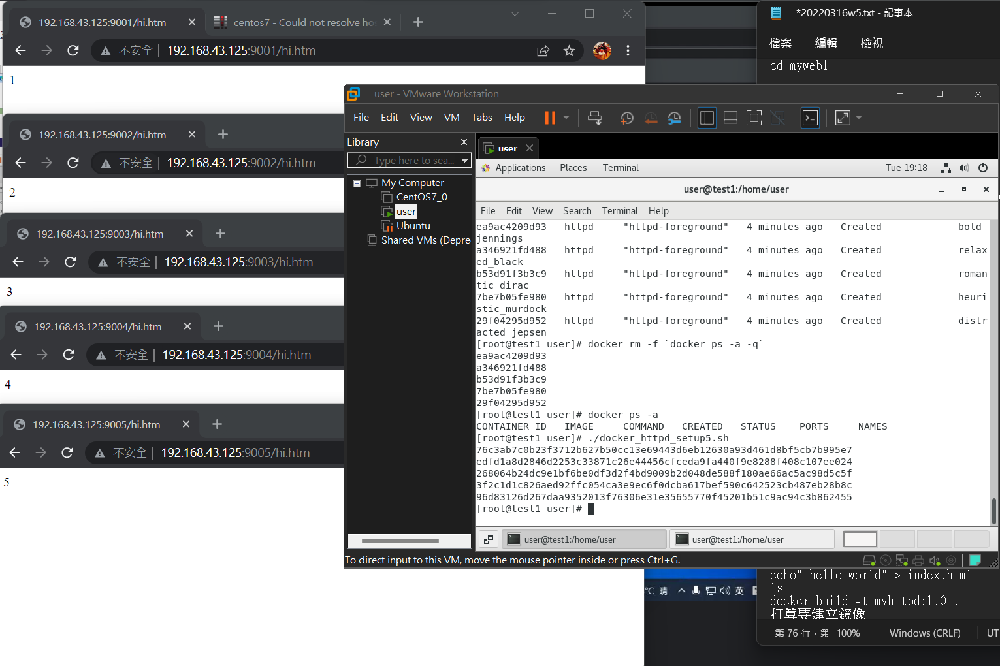
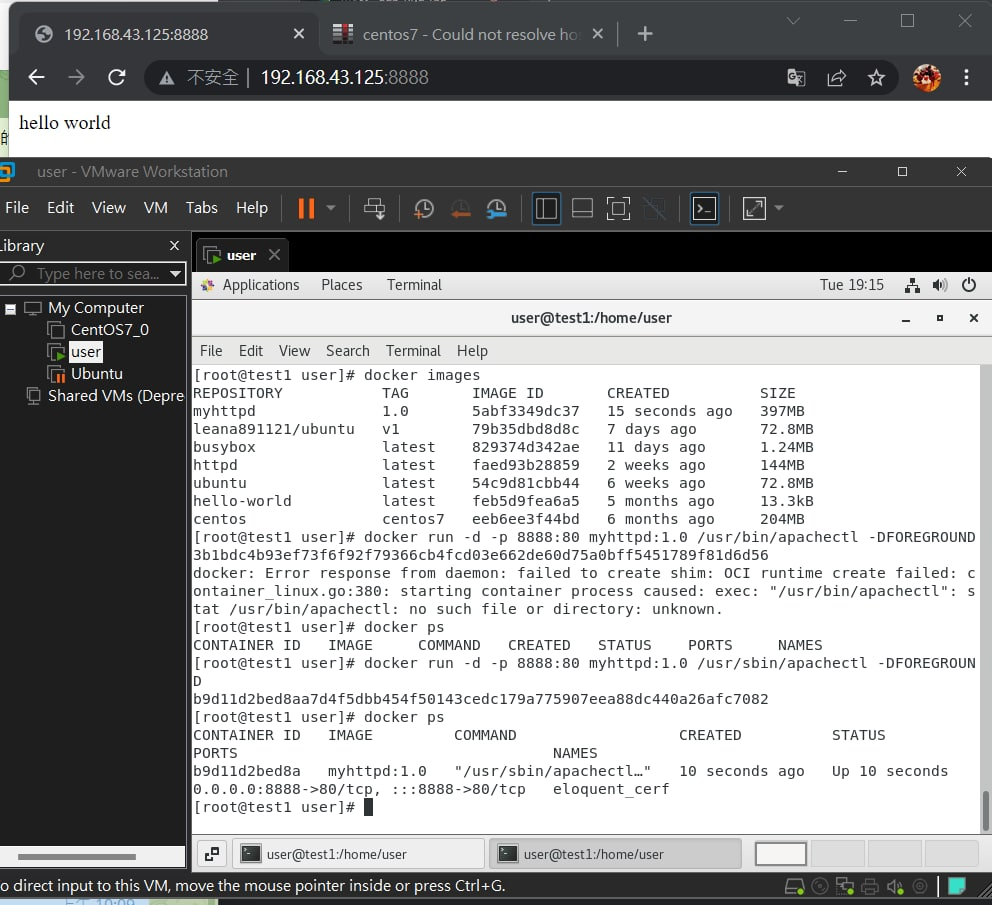
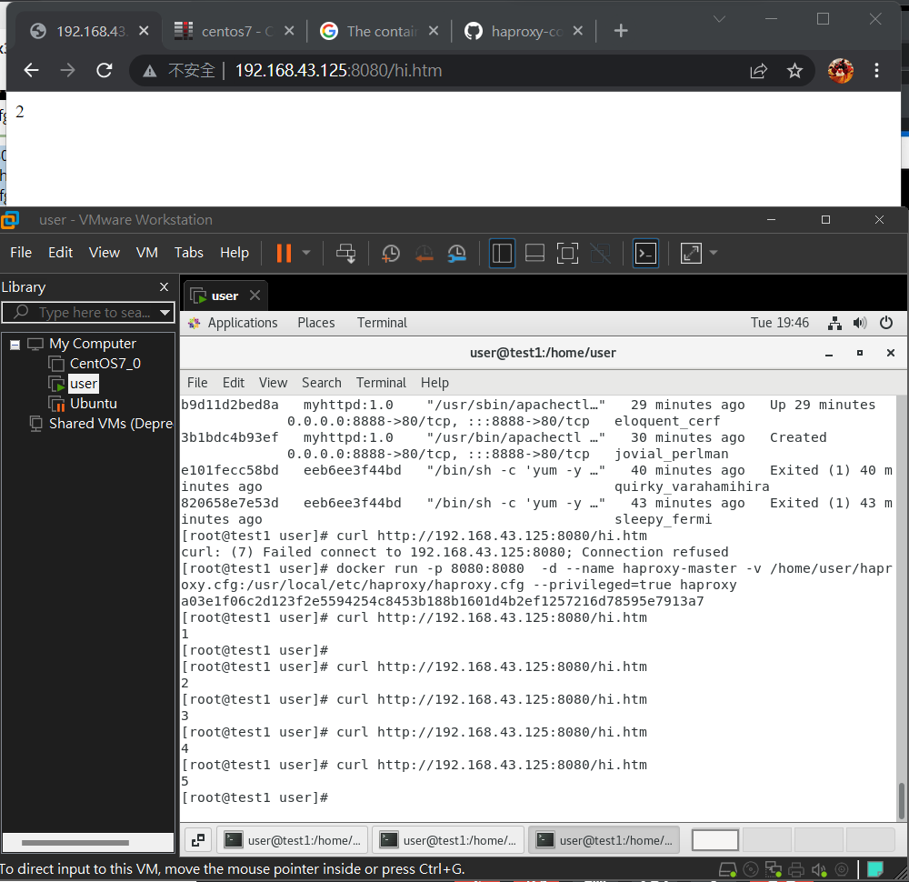
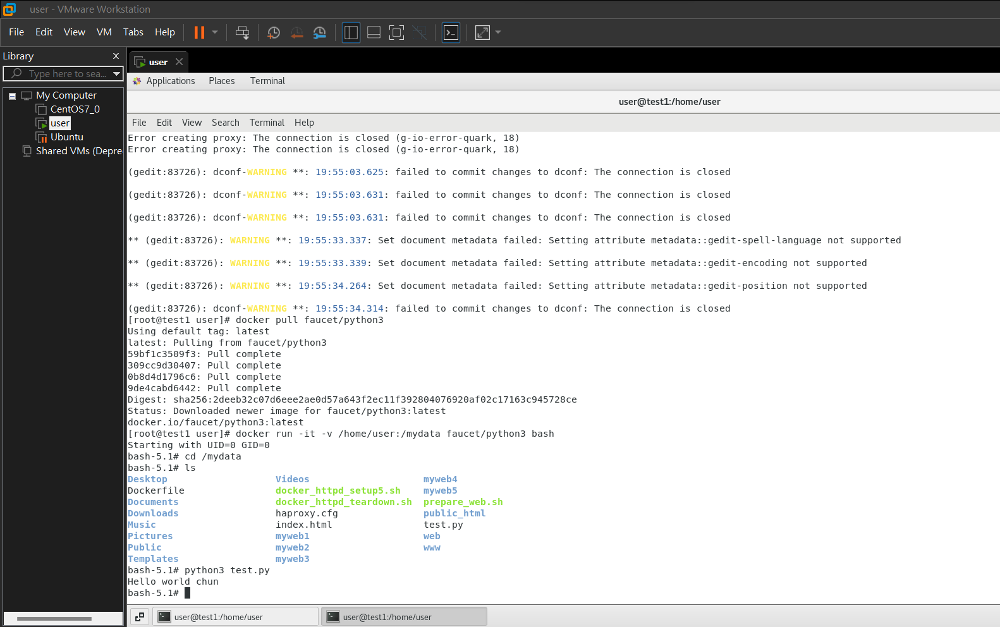

# 第五週

## 運用腳本的方式建立5個檔案

    gedit prepare_web.sh  

prepare_web.sh

    #!/usr/bin/bash

    fori in {1..5};
    do
        mkdir -p myweb$i
        cd myweb$i
        echo $i > hi.htm
        cd ..
    done

 -p 是不存在就建立  

    chmod +x prepare_web.sh  
    ls  
    cd myweb1  
    gedit docker_http_setup5.sh  

 docker_http_setup5.sh 

    #!/usr/bin/bash  

    for i in {1..5};  
    do  
    portno=`expr 9000 + $i`  
    docker run -d -p $portno:80 -v /home/user/myweb$i:user/local/apache2/htdocs httpd
    done

接續執行

    ./docker_httpd_setup5.sh
    ifconfig

在瀏覽器打上  
http://192.168.43.125:9001/hi.htm  
http://192.168.43.125:9002/hi.htm  
http://192.168.43.125:9003/hi.htm  
http://192.168.43.125:9004/hi.htm  
http://192.168.43.125:9005/hi.htm  

* 解決錯誤
如果./docker_httpd_setup5.sh不能執行  
`docker rm -f 'docker ps -a -q'`   
還是不能執行 先確定docker是否開啟  
`systemctl start docker`  
最後可以用  
`yum updata`

---

## docker 指令

### 使用Dockerfile
建立新的鏡像可以用這個  

    gedit Dockerfile &

Dockerfile

    FROM centos:centos7
    RUN yum -y install httpd
    EXPOSE 80
    ADD index.html /var/www/html

街續

    echo" hello world" > index.html
    ls
    docker build -t myhttpd:1.0 .
    打算要建立鏡像
    docker image
    docker run -d -p 8888:80 myhttpd:1.0 /usr/sbin/apachectl -DFOREGROUND

---

## haproxy
把每次的請求跟不同人要 重複案重新整理就會出先不同畫面  
docker logs bd0 可以看到我的docker訊息  

    gedit haproxy.cfg

haproxy.cfg

    defaults
    mode http
    timeout client 10s
    timeout connect 5s
    timeout server 10s
    timeout http-request 10s

    frontend myfrontend
    bind 0.0.0.0:8080
    default_backend myservers

    backend myservers
    balance roundrobin
    server server1 192.168.43.125:9001
    server server2 192.168.43.125:9002
    server server3 192.168.43.125:9003
    server server4 192.168.43.125:9004
    server server5 192.168.43.125:9005

接續

    docker run -p 8080:8080  -d --name haproxy-master -v /home/user/haproxy.cfg:/usr/local/etc/haproxy/haproxy.cfg --privileged=true haproxy

    curl http://192.168.43.125:8080/hi.htm

---

## docker的好處
可以在dockerhub中找到python3  
然後運用docker使用python  
而無須下載下來  
就不會有不可相容的問題  

    gedit test.py
    docker pull faucet/python3
    docker run -it -v /home/user:/mydata faucet/python3 bash

    python3 test.py
    就會顯示答案囉

