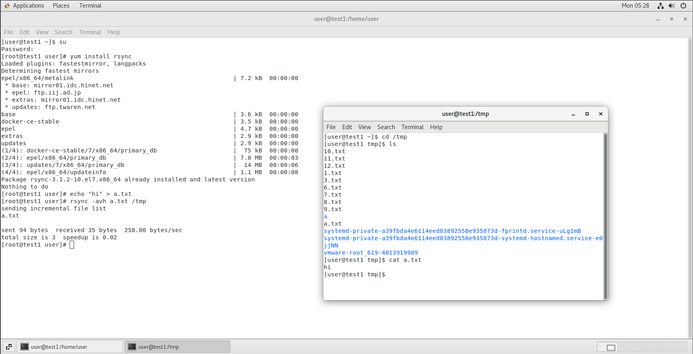
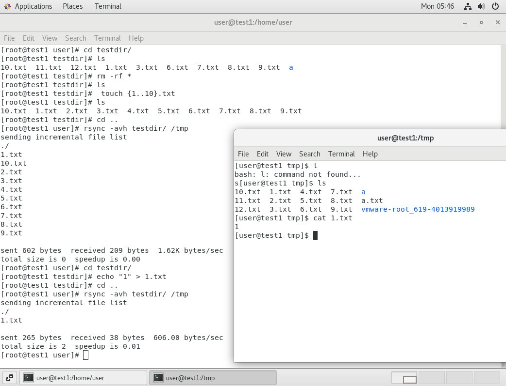
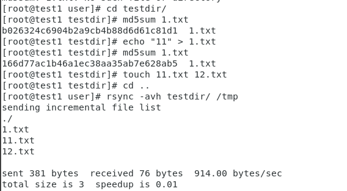
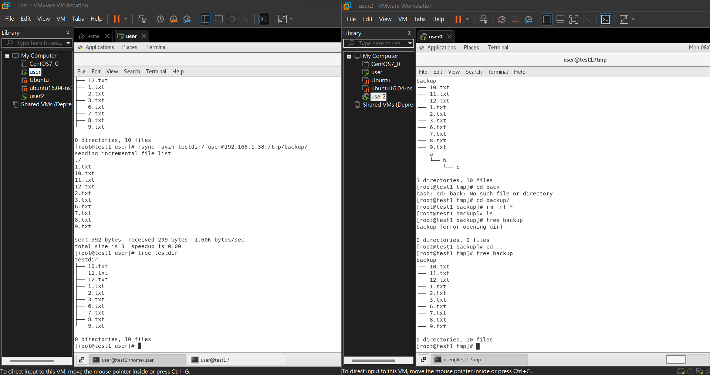

# 第六週(剩下inotify未完成20220323)

## 參考網頁:
[Linux运维：rsync+inotify实时同步](https://segmentfault.com/a/1190000018096553)  
[Linux 使用 rsync 遠端檔案同步與備份](http://www.4u.idv.tw/2019/11/09/linux-%E4%BD%BF%E7%94%A8-rsync-%E9%81%A0%E7%AB%AF%E6%AA%94%E6%A1%88%E5%90%8C%E6%AD%A5%E8%88%87%E5%82%99%E4%BB%BD/)

## rsync
當客戶上傳資料的時候  
我們會將資料備份到後面去  
當持續更新時  
會將有差異的地方在備份  

- cp 是本地端copy  
- scp 可支援遠端更新

* yum install rsync #安裝rsync  
* rpm -qa | grep rsync #查案安裝板本

---

## 本地端複製
[termine 1]

```
echo "hi" > a.txt
rsync -avh a.txt /tmp
file list
```
[termine 2]
```
cd /tmp
ls
```
就可以看見在本地端出現檔案



---

## 差異式備份原理 = md5sum
### 差異式備份
[termine 1]
```
mkdir testdir
cd testdir/
ls
touch {1..10}.txt
ls
cd ..
rsync -avh testdir/ /tmp
```
[termine 2]
```
ls
#可以查看是否完全備份
```
[termine 1]
```
cd testdir/
echo "1" > 1.txt
cd ..
rsync -avh testdir/ /tmp
```
將會顯現出只備份不一樣的部分



### md5sum
[termine 1]
```
cd testdir/
md5sum 1.txt
echo "11" > 1.txt
md5sum 1.txt
touch 11.txt 12.txt
cd ..
rsync -avh testdir/ /tmp
```


---
## 遠端備份
[user2 termine]
```
mkdir backup  #在tmp下面
```

[user1 termine]
```
ssh-copy-id user@192.168.1.38  #免密碼輸入
ssh user@192.168.1.38  #確定可以連線
rsync -avzh testdir/ user@192.168.1.38:/tmp/backup/
tree testdir
```
[user2 termine]
```
tree backup
```
用tree確定有備份過來  
如果沒有tree  
記得 ` yum install tree `



---
## inotify
隨時監控


# 結論
當rsync結合inotify就可以進行監控  
當駭客登入進網站並進行修改時  
我們backup的東西將會被及時取出  
不讓網頁遭到破懷  


