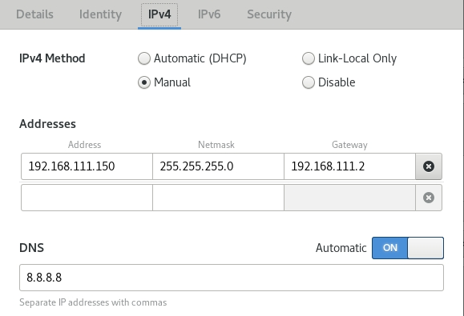
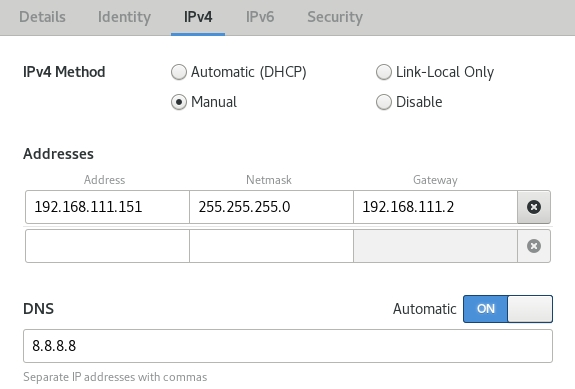
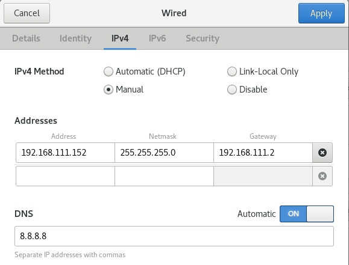

# 第一週

## 學期課程介紹
雲端技術最需要的就是高可靠 不可讓使用中斷 當機器當掉上面容器會自動跳到其他容器上去執行 

* Docker
* Docker-compose 可執行與管理多台docker
* Docker Swarm 
* Docker value 用來儲存
* Kubernetes

* scalability 擴容 

## 新增三台虛擬機

### docker設定

    yum list docker-ce --showduplicates # 可以查看下載清單
    yum install docker-ce-18.09.0 docker-ce-cli-18.09.0 #指定版本下載
    systemctl start docker #開啟
    docker images #鏡像

接著clone出user4-2 user4-3

### 固定ip位置
到wired settings設定IPV4  

user4-1 192.168.111.150

user4-2 192.168.111.151

user4-3 192.168.111.152

### 建立各自新名稱

    hostnamectl set-hostname user4-x
    bash
    vim /etc/hosts
    
在每一台電腦新增

    192.168.111.150 user4-1 user4-1.test.com
    192.168.111.151 user4-2 user4-2.test.com
    192.168.111.152 user4-3 user4-3.test.com

### 無密碼登入
使用user4-1

    ssh-keygen
    cd
    cd .ssh
    ssh-copy-id root@user4-2
    ssh-copy-id root@user4-3
    ssh root@user4-2
    ssh root@user4-3
    scp /etc/hosts root@user4-2:/etc/hosts
    scp /etc/hosts root@user4-3:/etc/hosts

## Docker 指令複習

* docker create -h
* docker start 啟動
* docker images 鏡像
* docker pull httpd 下載鏡像

## 網路教學資源
下載虛擬機與安裝:  
[CentOS 7.5 docker 18.09 的安装](https://blog.csdn.net/vkingnew/article/details/85241600) 
[Kubernetes各版本對應的docker版本列表](https://cxybb.com/article/M82_A1/98872734#google_vignette) 
[2022版Docker實戰教程](https://www.bilibili.com/video/BV1gr4y1U7CY?p=1&share_medium=android_i&share_plat=android&share_source=COPY&share_tag=s_i&timestamp=1659497359&unique_k=pLhuJqX) 
[Kubernetes（k8s）入門的實戰教程](https://www.bilibili.com/video/BV1GT4y1A756?p=1&share_medium=android_i&share_plat=android&share_source=COPY&share_tag=s_i&timestamp=1659497332&unique_k=WfurS8T) 
[Docker Swarm Master](https://www.bilibili.com/video/BV1cb411S7jw?p=1&share_medium=android_i&share_plat=android&share_source=COPY&share_tag=s_i&timestamp=1659497287&unique_k=EVeoovr)

Docker基礎操作補充:  
[Docker 使用 Linux namespace 隔离容器的運行环境](https://developer.aliyun.com/article/377862) 
[Docker 容器使用 cgroups 限制资源使用](https://www.cnblogs.com/sammyliu/p/5886833.html) 
[linjiachi/Linux_note](https://github.com/linjiachi/Linux_note/tree/master/109-1%20Docker) 