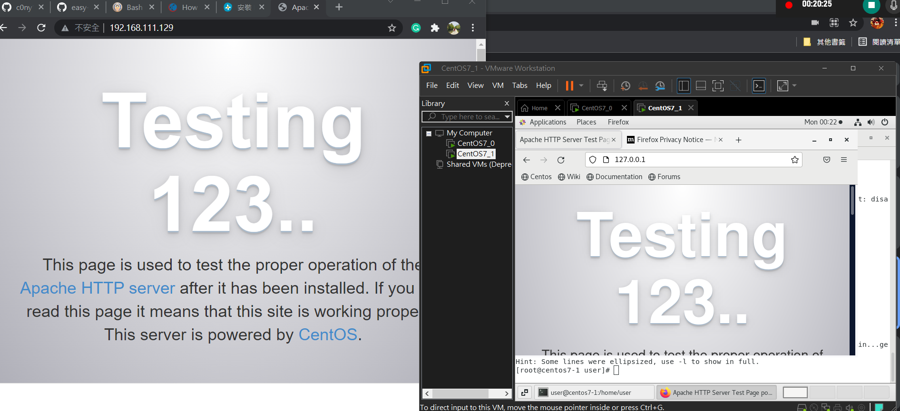
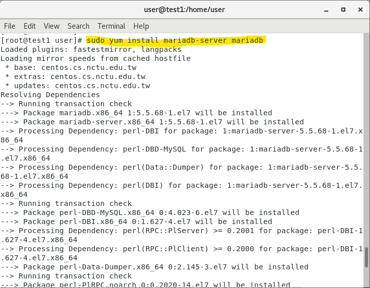
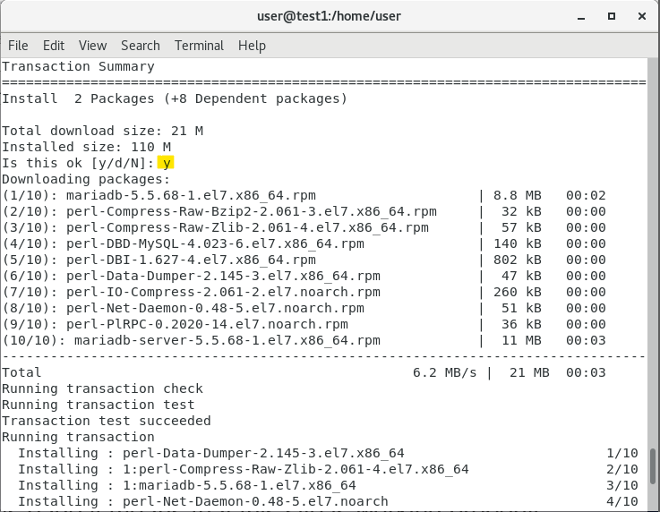
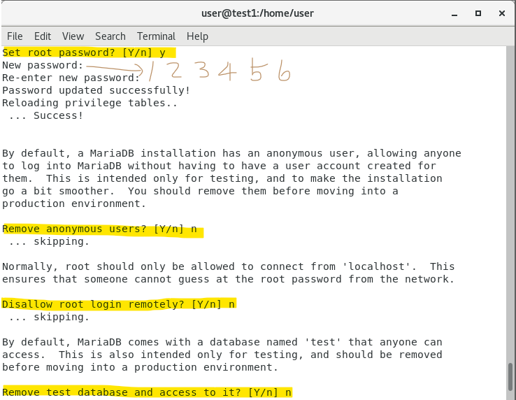
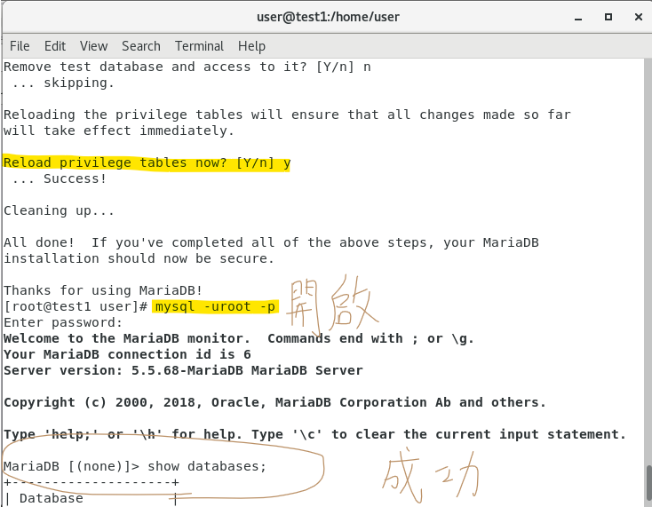

# 第8週

## 前言

github upload-labs 資安相關關卡    
還有關卡說明 使用流程  

## 如何知道別人登入在網頁中的帳號密碼
打開 開發人員工具  
找到文字輸入方塊  
並在上面輸入 password  
並找到當行 編輯 刪除 type="password"  
就會顯示密碼出來  

所以用學校電腦裡面進行帳號密碼輸入記得開無痕  
---

## 簡單腳本程式設計

判斷檔案是否存在  
如果不存在就創建  

在1.sh的檔案中 需要打上  

    #!/usr/bin/bash 

    if ! test -e /tmp/a.txt;
    then
        touch /tmp/a.txt
    fi

---------------- 第二堂 ---------------

which bash 可以查看bash在哪裡  

要編輯檔案時 需要使用的  
` $ gedit 2.sh `  
2.sh的檔案中 需要打上 --------------------------- 0

    #!/user/bin/bash

    n1=10
    n2=15
    test $n1 -gt $n2
    if [ $? -eq 0 ]; then
    echo $n1 "is greater than" $n2
    else
    echo $n1 "isless than or equal to " $n2
    fi

執行  
` $ chmod +x 2.sh `  
` $ ./2.sh `  

` $bash -x 2.sh `  
想要除錯的時候用 因為會一行一行檢查 -x

修改2.sh檔中的檔案 如下 --------------------------- 1  

    #!/user/bin/bash

    n1=$1
    n2=$2
    test $n1 -gt $n2
    if [ $? -eq 0 ]; then
    echo $n1 "is greater than" $n2
    else
    echo $n1 "isless than or equal to " $n2
    fi

執行  
` $ bash -x 2.sh 15 5 `  

差別在於如何是否可以自己寫數字上去  
去做判斷   

修改2.sh檔中 如下 --------------------------- 2

    #!/user/bin/bash

    echo "aaa=$0"  
    n1=$1
    n2=$2
    test $n1 -gt $n2
    if [ $? -eq 0 ]; then
    echo $n1 "is greater than" $n2
    else
    echo $n1 "isless than or equal to " $n2
    fi

$0就是顯示執行檔案的名稱
---

## centos ch12-5

如果想要讀取使用者輸入  

3.sh 檔案中  

    #!/usr/bin/bash

    for file in `ls *.sh`
    do 
        echo $file
        mv $file | tr ".txt" ".text"
    done

---
4. nstall PHP  

## Apacha

* 參考資料:[How to Install the LAMP Stack on CentOS 7](https://www.phoenixnap.pt/kb/how-to-install-lamp-stack-on-centos)

需要事先確認  
`systemctl start sshd`  
`systemctl status sshd`  
`systemctl stop firewalld`  
`systemctl status firewalld`  
`getenforce`  
要確定為Disabled 如果沒有才要執行下面這個  
`gedit /etc/selinux/config`  
`reboot`  
並重新開機

`sudo yum install httpd`    
`systemctl stop fierwalld`    
`systemctl status firewalld`  
`ifconfig`  
`systemctl start httpd`  
`systemctl status httpd`  

到這裡  
在linux 開啟 firefox 打上 `http://127.0.0.1`  
在windows 開啟chrome 打上 `192.168.111.141`  
兩個頁面皆要為test123...  

## MySQL
`sudo yum install mariadb-server mariadb`  
`systemctl start mariadb.service`   
`systemctl status mariadb`  
`mysql_secure_installation `  
`mysql -uroot -p` 

  
  
  
  

到這裡就進入資料庫  
接這進行基本設定  
show databases;  
create database  testdb;  
show databases;  

use testdb;  代表要切換到哪個資料庫  
create table addrbook(name varchar(50) not null, phone varchar(10));  
 創一個電話簿(addr book) 兩個欄位 一個名字一個號碼  

insert into addrbook(name, phone) values ("tom","123456789");  
insert into addrbook(name, phone) values ("mary","0987654321");  
select * from addrbook);  

如果要離開 就打上 `exit`  

## php
`yum install php php-mysql`  
`systemctl restart httpd`  
`cd /var/www/html`  
`ls`  
`vim test.php`  

    <?php
    phpinfo();
    ?>

在windows中打上 `192.168.111.142/test.php`

`vim hi.php`  

    <?php
    $servername="localhost";
    $username="root";
    $password="123456";
    $dbname="testdb";

    $conn = new mysqli($servername, $username, $password, $dbname);

    if ($conn->connect_error) {
        die("connection failed: ". $conn->connect_error);
    }
    //echo "connection ok"

    $sql="select name, phone from addrbook";
    $result=$conn->query($sql);

    if($result->num_rows>0){
        while($row=$result->fetch_assoc()){
            echo "name:" . $row["name"]." phone:". $row["phone"]." ";
        }
    }
    ?>

在windows中打上 `192.168.111.142/hi.php`
就完成囉~  

確定是否打對   
`systemctl restart httpd`  
`cd /var/www/html`  
`cat test.php`  
`cat hi.php`  

