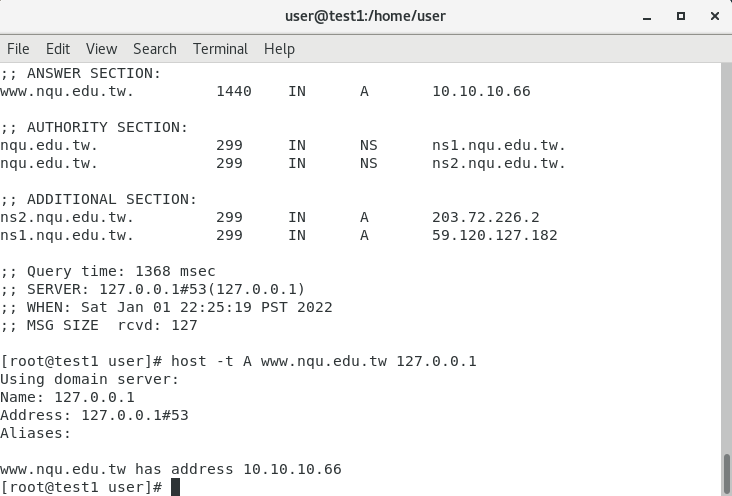
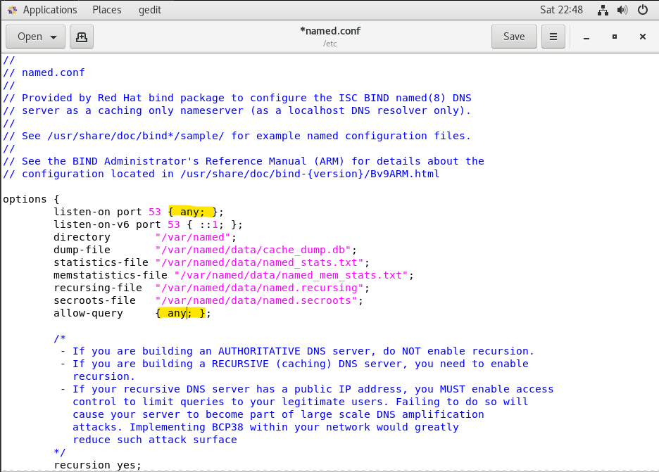
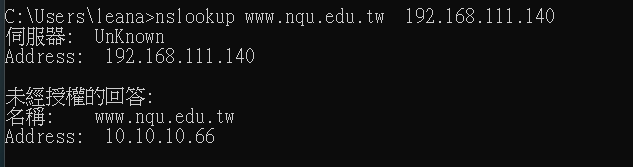
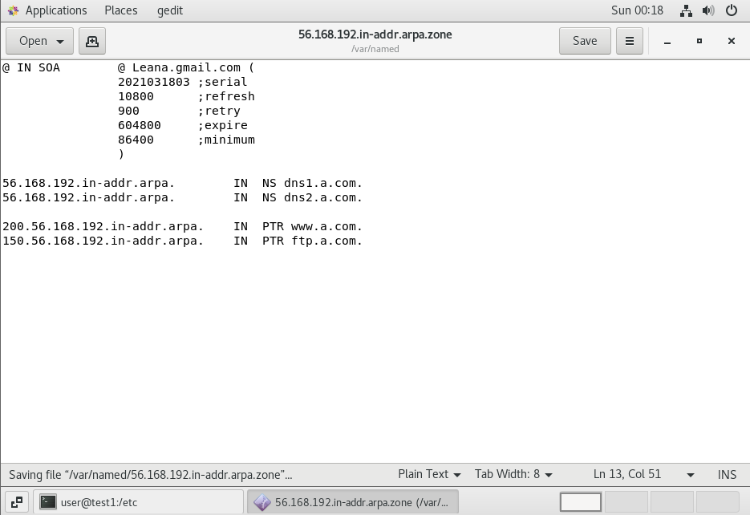
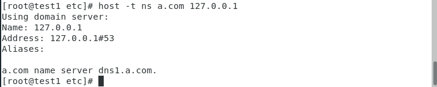
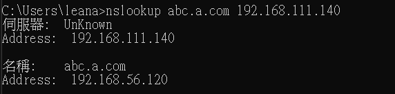

# 第16週

## Bind 
`yum install bind bind-chroot bind-utils -y`  
先安裝  
`systemctl start named`  
`systemctl status named`  
確認開啟named  
`netstat -tunlp | grep 53`  
`dig @127.0.0.1 www.nqu.edu.tw`  
`host -t A www.nqu.edu.tw 127.0.0.1`  

如果現在在windos下 如何看虛擬機的ip位置?  
在虛擬機本地端可以查看 但是在windows卻不行的原因是因為53只開在本地端  
所以想要讓所有介面都可以使用53的DNS服務  
就需要更改named.conf裡面的設定 

`gedit /etc/named.conf`

listen-on port 53 {any;}  
allow-query {any;}  

`systemctl restart named`  
重新啟動named   

接這開啟windows的cmd   
`nslookup www.nqu.edu.tw 192.168.111.140`   
就可以成功了  

管理一個網域  
`gedit /etc/named.rfc1912.zones`  

    zone "a.com" IN {
        type master;
        file "a.com.zone";
        allow-update { none; };
    };
    zone "56.168.192.in-addr.arpa" IN {
        type master;
        file "56.168.192.in-addr.arpa.zone";
        allow-update { none; };
    };

`gedit /var/named/a.com.zone`  

        $TTL 600 ;10 minutes

        @ IN SOA 	@ Leana.gmail.com (
                    2021031803 ;serial
                    10800      ;refresh
                    900        ;retry
                    604800     ;expire
                    86400      ;minimum
                    )
        @  		NS    dns1.a.com.
        dns.com. 	A     192.168.56.108
        dns1  		A     192.168.56.108
        www  		A     192.168.56.150
        eshop  		CNAME www
        ftp  		A     192.168.56.150
        abc  		A     192.168.56.120

`gedit /var/named/56.168.192.in-addr.arpa.zone`  

    @ IN SOA 	@ Leana.gmail.com (
                2021031803 ;serial
                10800      ;refresh
                900        ;retry
                604800     ;expire
                86400      ;minimum
                )

    56.168.192.in-addr.arpa.    	IN  NS dns1.a.com.
    56.168.192.in-addr.arpa.    	IN  NS dns2.a.com.

    200.56.168.192.in-addr.arpa.  	IN  PTR www.a.com.
    150.56.168.192.in-addr.arpa.  	IN  PTR ftp.a.com.

`systemctl restart named`  

確認linux可以連線到
`host -t ns a.com 127.0.0.1`

接這在換成windows  
`nslookup abc.a.com 192.168.111.140`  

